# СОДЕРЖАНИЕ

- [Задание на практическую работу](#1задание-на-практическую-работу)
- [Краткая теоретическая часть](#2краткая-теоретическая-часть)
  - [Описание шифров](#21описание-шифров)
  - [Методы криптоанализа шифров](#22методы-криптоанализа-шифров)
- [Примеры шифрования](#3-примеры-шифрования)
  - [«Ручное» шифрование и расшифрование шифра Виженера с помощью повторения ключа](#31-ручное-шифрование-и-расшифрование-шифра-виженера-с-помощью-повторения-ключа)
  - [«Ручное» шифрование и расшифрование шифра Виженера, используя самоключ по открытому тексту](#32-ручное-шифрование-и-расшифрование-шифра-виженера-используя-самоключ-по-открытому-тексту)
  - [«Ручное» шифрование и расшифрование шифра Виженера, используя самоключ по шифртексту](#33-ручное-шифрование-и-расшифрование-шифра-виженера-используя-самоключ-по-шифртексту)
- [Программная реализация шифров](#4программная-реализация-шифров)
  - [Программная реализация шифра Виженера с использованием повторного короткого лозунга](#41-программная-реализация-шифра-виженера-с-и-использованием-повторного-короткого-лозунга)
  - [Программная реализация шифра Виженера с использованием самоключа Виженера по открытому тексту](#42-программная-реализация-шифра-виженера-с-использованием-самоключа-виженера-по-открытому-тексту)
  - [Программная реализация шифра Виженера с использованием самоключа Виженера по шифртексту](#43-программная-реализация-шифра-виженера-с-использованием-самоключа-виженера-по-шифртексту)
- [Примеры криптоанализа](#5примеры-криптоанализа)
  - [Метод криптоанализа для шифра Виженера с повторяющимся ключом](#51-метод-криптоанализа-для-шифра-виженера-с-повторяющимся-ключом)
  - [Криптоанализ шифра Виженера, который использует самоключ по открытому тексту](#52-криптоанализ-шифра-виженера-который-использует-самоключ-по-открытому-тексту)
  - [Криптоанализ шифра Виженера, который использует самоключ по шифртекст](#53-криптоанализ-шифра-виженера-который-использует-самоключ-по-шифртекст)
- [Выводы о проделанной работе](#6выводы-о-проделанной-работе)
- [Список использованных источников](#7список-использованных-источников)

# 1 Задание на практическую работу

Целью данной работы является приобретение навыков программной реализации
и криптоанализа применительно к шифрам гаммирования.

В рамках практической работы необходимо выполнить следующее:

1)  написать программную реализацию следующих шифра Виженера с тремя способами выработки гаммы на основе секретного ключа шифрования:

* повторение короткого лозунга;
* самоключ Виженера по открытому тексту;
* самоключ Виженера по шифртексту.

2)  изучить методы криптоанализа шифров гаммирования с использованием дополнительных источников;
3)  провести криптоанализ данных шифров;
4)  подготовить отчет о выполнении работы.

Программа должна обладать следующей функциональностью для каждого из
реализованных в ней шифров:

1)  принимать на вход произвольную последовательность символов, вводимую
    пользователем в качестве открытого текста или шифртекста;

2)  принимать на вход секретный ключ вида, соответствующего конкретному
    шифру;

3)  осуществлять зашифрование или расшифрование введенного текста по
    выбору пользователя.

# 2 Краткая теоретическая часть

## 2.1 Описание шифров

Гаммирование заключается в наложении на
открытый текст некоторой последовательности (гаммы), генерируемой на
основе ключа шифрования. Под наложением гаммы на открытый текст обычно
подразумевается сложение символов открытого текста с символами гаммы по
модулю соответствующего алфавита. Однако в классических шифрах наложение
гаммы может означать вычисление значений символов шифртекста на основе
значений соответствующих символов открытого текста и гаммы по некоторому
правилу.

Классическим представителем шифров гаммирования является шифр Виженера,
устроенный следующим образом:

Символы алфавита $A$ мощностью $m$ представляются элементами множества
$\mathbb{Z}_{m}$. 

Открытый текст и шифртекст обозначим соответственно $x = \left( x_{1},\mspace{6mu}\ldots,\mspace{6mu} x_{l} \right)$ и 
$y = \left( y_{1},\mspace{6mu}\ldots,\mspace{6mu} y_{l} \right)$, где
$x_{i},y_{i} \in Z_{m}$, $i = \overline{1,l}$.

Ключ шифрования представляет собой некоторую последовательность символов
алфавита
$k = \left( k_{1},\mspace{6mu}\ldots,\mspace{6mu} k_{r} \right)$,
$k_{j} \in Z_{m}$, $j = \overline{1,r}$, $r \leq l$, которая служит для
формирования гаммы
$\gamma = \left( \gamma_{1},\mspace{6mu}\ldots,\mspace{6mu}\gamma_{r} \right)$,
$\gamma_{i} \in Z_{m}$, $i = \overline{1,r}$.

Зашифрование заключается в сложении символов открытого текста с
символами гаммы по модулю $m$: 
$y_{i} = \left( x_{i} + \gamma_{i} \right)\ mod\ m$.

Расшифрование заключается в вычитании символов гаммы из символов
шифртекста по модулю $m$.

В шифре Виженера в качестве ключа шифрования обычно использовалась
короткая фраза, называемая лозунгом (паролем), которая циклически
повторялась, формируя гамму.

Существует другой подход к формированию псевдослучайной ключевой
последовательности – самоключ Виженера. Здесь в качестве начального
ключа мы выбираем только один символ, к нему добавляем все символы
открытого текста, за исключением последнего, и таким образом формируем
гамму. Либо мы можем формировать гамму, добавляя к начальному символу
поочередно символы шифртекста

## 2.2 Методы криптоанализа шифров

Сила шифра Виженера заключается в том, что он не поддается частотному
анализу из-за того, что шифр чередуется с разными сдвигами, поэтому одна
и та же буква открытого текста не всегда будет зашифрована в одну и ту
же букву зашифрованного текста. Например, если «P» – самая
распространенная буква в зашифрованном английском тексте, мы можем
предположить, что это буква «E». Однако с шифром Виженера это не так.
\[1\]

Однако шифр Виженера с повторяющимися ключам уязвим перед двухэтапным
статистическим криптоанализом:

* вычисление длины ключа с помощью теста Касиски или индекса совпадений;

* вычисление символов ключа посредством частотного анализа.

Анализ индекса совпадения основан на определении статистической меры,
которая указывает на вероятность того, что две произвольно выбранные
буквы из текста будут совпадать. \[2\]

Криптоанализ с помощью теста Касиски заключается в обнаружении
повторяющихся последовательностей символов в зашифрованном тексте, чтобы
определить длину ключа. Затем применяется частотный анализ на каждую
колонку текста, что позволяет расшифровать текст. \[1\]

Также для криптоанализа шифра Виженера используется метод восстановления
открытых текстов зашифрованных с использованием общей гаммы. Этот метод
основан на анализе различий между двумя зашифрованными текстами, которые
были зашифрованы одним и тем же ключом, но с разными значениями
открытого текста.

# 3 Примеры шифрования

## 3.1 «Ручное» шифрование и расшифрование шифра Виженера с помощью повторения ключа.

Для того, чтобы разобрать шифрование шифра Виженера, возьмём слово
"SAZONOVGEO" за открытый текст. Ключ возьмём "KEY". Способ выработки
гаммы повторением ключа подразумевает, что гамма будет длиной как
открытый текст. Значит гамма будет равна "KEYKEYKEYK".

Для начала пронумеруем каждый символ открытого текста и гаммы по
порядковому номеру в алфавите, считая что "A" соответствует 0. Получаем
для исходного сообщения "18, 0, 25, 14, 13, 14, 21, 6, 4, 14", а для
гаммы "10, 4, 24, 10, 4, 24, 10, 4, 24, 10".

Каждый символ шифртекста будет находиться по формуле:

$$y_{i} = \left( x_{i} + \gamma_{i} \right)\ mod\ 26$$

Значит шифртекст будет состоять из следующих символов:

$y_{1}$ = (18+10) mod 26 = 2, что соответствует букве "C",

$y_{2}$ = (0+4) mod 26 = 4, что соответствует букве "E",

$y_{3}$ = (25+24) mod 26 = 23, что соответствует букве "X",

$y_{4}$ = (14+10) mod 26 = 24, что соответствует букве "Y",

$y_{5}$ = (13+4) mod 26 = 17, что соответствует букве "R",

$y_{6}$ = (14+24) mod 26 = 12, что соответствует букве "M",

$y_{7}$ = (21+10) mod 26 = 5, что соответствует букве "F",

$y_{8}$ = (6+4) mod 26 = 10, что соответствует букве "K",

$y_{9}$ = (4+24) mod 26 = 2, что соответствует букве "C",

$y_{10}$ = (14+10) mod 26 = 24, что соответствует букве "Y".

Получаем шифртекст "CEXYRMFKCY".

Для рассмотрения процесса расшифровки возьмём полученный раннее
шифртекст "CEXYRMFKCY". Возьмём тот же ключ "KEY", гамма будет равна
"KEYKEYKEYK".

Пронумеруем каждый символ шифртекста и гаммы по порядковому номеру в
алфавите. Получаем для шифртекста "2, 4, 23, 24, 17, 12, 5, 10, 2, 24",
а для гаммы "10, 4, 24, 10, 4, 24, 10, 4, 24, 10".

Каждый символ шифртекста будет находиться по формуле:

$$x_{i} = \left( y_{i} - \gamma_{i} \right)\ mod\ 26$$

Значит исходное сообщение будет состоять из следующих символов:

$x_{1}$ = (2–10) mod 26 = 18, что соответствует букве "S",

$x_{2}$ = (4–4) mod 26 = 0, что соответствует букве "A",

$x_{3}$ = (23–24) mod 26 = 25, что соответствует букве "Z",

$x_{4}$ = (24–10) mod 26 = 14, что соответствует букве "O",

$x_{5}$ = (17–4) mod 26 = 13, что соответствует букве "N",

$x_{6}$ = (12–24) mod 26 = 14, что соответствует букве "O",

$x_{7}$ = (5–10) mod 26 = 21, что соответствует букве "V",

$x_{8}$ = (10–4) mod 26 = 6, что соответствует букве "G",

$x_{9}$ = (2–24) mod 26 = 4, что соответствует букве "E",

$x_{10}$ = (24–10) mod 26 = 14, что соответствует букве "O".

В итоге получаем исходное сообщение = "SAZONOVGEO".

## 3.2 «Ручное» шифрование и расшифрование шифра Виженера, используя самоключ по открытому тексту.

Разберём процесс шифрования. Возьмём слово "SAZONOV" за открытый текст и
ключ равный 7. Самоключ по открытому тексту как один из способов
выработки гаммы означает, что первый элемент гаммы будет равен ключу, а
оставшиеся элементы гаммы – записанные по порядку порядковые номера
символов открытого текста за исключением последнего, то есть гамма будет
равна "HSAZONO". Порядковые номера открытого текста равны "18, 0, 25,
14, 13, 14, 21", а порядковые номера гаммы – "7, 18, 0, 25, 14, 13,
14". Каждый элемент шифртекста рассчитывается по следующей формуле:

$$y_{i} = \left( x_{i} + \gamma_{i} \right)\ mod\ 26$$

Значит шифртекст будет состоять из следующих элементов:

$x_{1}$ = (18+7) mod 26 = 25, что соответствует букве "Z",

$x_{2}$ = (0+18) mod 26 = 18, что соответствует букве "S",

$x_{3}$ = (25+0) mod 26 = 25, что соответствует букве "Z",

$x_{4}$ = (14+25) mod 26 = 13, что соответствует букве "N",

$x_{5}$ = (13+14) mod 26 = 1, что соответствует букве "B",

$x_{6}$ = (14+13) mod 26 = 1, что соответствует букве "B",

$x_{7}$ = (21+14) mod 26 = 9, что соответствует букве "J",

Получаем в итоге шифртекст "ZSZNBBJ".

Для рассмотрения процесса расшифровки возьмём полученный раннее
шифртекст "ZSZNBBJ". Возьмём тот же ключ 7.

Пронумеруем каждый символ шифртекста и гаммы по порядковому номеру в
алфавите. Получаем для шифртекста "25, 18, 25, 13, 1, 1, 9", а для гаммы
"7, $x_{2}, x_{3}, x_{4}, x_{5}, x_{6}, x_{7}$". Затем рассчитываем
каждый символ исходного сообщения используя формулу:

$$x_{i} = \left( y_{i} - \gamma_{i} \right)\ mod\ 26$$

Вычисляем исходное сообщение:

$x_{1}$ = (25–7) mod 26 = 18, что соответствует букве "S", $\gamma_{2}$
= 18,

$x_{2}$ = (18–18) mod 26 = 0, что соответствует букве "A", $\gamma_{3}$
= 0,

$x_{3}$ = (25–0) mod 26 = 25, что соответствует букве "Z", $\gamma_{4}$
= 25,

$x_{4}$ = (13–25) mod 26 = 14, что соответствует букве "O",
$\gamma_{5}$ = 14,

$x_{5}$ = (1–14) mod 26 = 13, что соответствует букве "N", $\gamma_{6}$
= 13,

$x_{6}$ = (1–13) mod 26 = 14, что соответствует букве "O", $\gamma_{7}$
= 14,

$x_{7}$ = (9–14) mod 26 = 21, что соответствует букве "V".

В итоге получаем исходное сообщение = "SAZONOV". Гамма при этом равна
"HSAZONO".

## 3.3 «Ручное» шифрование и расшифрование шифра Виженера, используя самоключ по шифртексту.

Для того, чтобы разобрать шифрование шифра Виженера, возьмём слово
"SAZONOV" за открытый текст. Ключ возьмём равный 8. Самоключ по
шифртексту как один из способов выработки гаммы означает, что первый
элемент гаммы будет равен ключу, а оставшиеся элементы гаммы –
записанные по порядку порядковые номера символов шифртекста за
исключением последнего. Это означает, что гамма будет формироваться в
процессе шифрования.

Для начала пронумеруем каждый символ открытого текста по порядковому
номеру в алфавите, считая что "A" соответствует 0. Получаем "18, 0, 25,
14, 13, 14, 21". Гамма в начале шифрования будет равна
$"8,\ \gamma_{2},\ \gamma_{3},\gamma_{4},\gamma_{5},\gamma_{6},\gamma_{7},"$

Каждый символ шифртекста будет находиться по формуле:

$$y_{i} = \left( x_{i} + \gamma_{i} \right)\ mod\ 26$$

Теперь рассчитываем шифртекст:

$y_{1}$ = (18+8) mod 26 = 0, что соответствует букве "A", $\gamma_{2}$ =
0,

$y_{2}$ = (0+0) mod 26 = 0, что соответствует букве "A", $\gamma_{3}$ =
0,

$y_{3}$ = (25+0) mod 26 = 25, что соответствует букве "Z", $\gamma_{4}$
= 25,

$y_{4}$ = (14+25) mod 26 = 13, что соответствует букве "N", $\gamma_{5}$
= 13,

$y_{5}$ = (13+13) mod 26 = 0, что соответствует букве "A", $\gamma_{6}$
= 0,

$y_{6}$ = (14+0) mod 26 = 14, что соответствует букве "O", $\gamma_{7}$
= 14,

$y_{7}$ = (21+14) mod 26 = 9, что соответствует букве "J".

Получаем шифртекст "AAZNAOJ", гамма же равна "IAAZNAO"

Для рассмотрения процесса расшифровки возьмём полученный раннее
шифртекст "AAZNAOJ". Возьмём тот же ключ 8. гамма будет равна "IAAZNAO".

Пронумеруем каждый символ шифртекста и гаммы по порядковому номеру в
алфавите. Получаем для шифртекста "0, 0, 25, 13, 0, 14, 9", а для гаммы
"8, 0, 0, 25, 13, 0, 14".

Каждый символ шифртекста будет находиться по формуле:

$$x_{i} = \left( y_{i} - \gamma_{i} \right)\ mod\ 26$$

Значит исходное сообщение будет состоять из следующих символов:

$x_{1}$ = (0–8) mod 26 = 18, что соответствует букве "S",

$x_{2}$ = (0–0) mod 26 = 0, что соответствует букве "A",

$x_{3}$ = (25–0) mod 26 = 25, что соответствует букве "Z",

$x_{4}$ = (13–25) mod 26 = 14, что соответствует букве "O",

$x_{5}$ = (0–13) mod 26 = 13, что соответствует букве "N",

$x_{6}$ = (14–0) mod 26 = 14, что соответствует букве "O",

$x_{7}$ = (9–14) mod 26 = 21, что соответствует букве "V".

В итоге получаем исходное сообщение = "SAZONOV".

# 4 Программная реализация шифров

## 4.1 Программная реализация шифра Виженера с и использованием повторного короткого лозунга:

Программная реализация шифра Виженера с и использованием повторного короткого лозунга представлена на рисунках ниже:

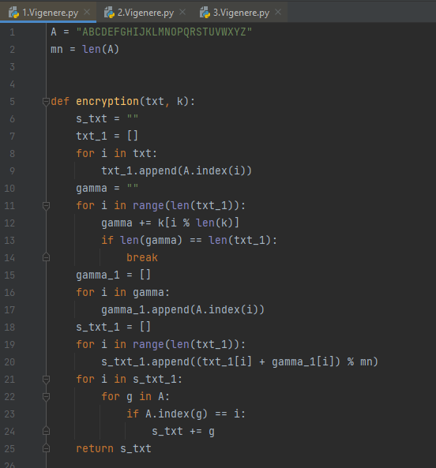

Рассмотрим рисунок выше поподробнее:

"A" – все символы английского алфавита по порядку

"mn" – мощность алфавита

На 5 строке кода функция "encryption" принимает на вход сообщение и
ключ, а возвращает шифртекст.

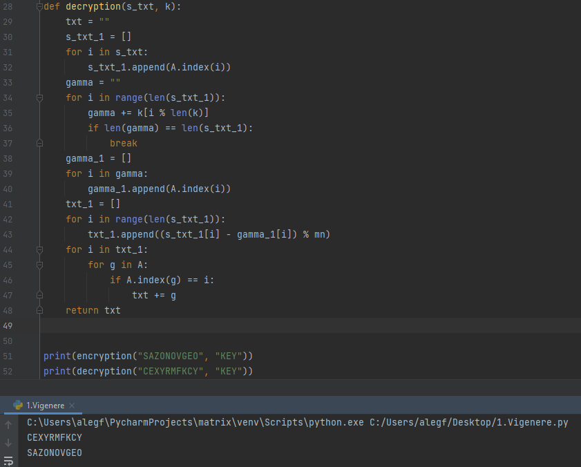

Рассмотрим этот рисунок поподробнее:

На 28 строке кода функция "decryption" принимает на вход шифртекст и
ключ, а возвращает полученное сообщение.

Функция "print" на 51 строке выводит результат шифрования для функции
"encryption" с заданными значениями.

Функция "print" на 52 строке выводит результат расшифрования для функции
"decryption" с заданными значениями.

Заметим, что результат работы программы совпал с "ручным" шифрованием,
выполненным раннее в пункте 3.1.

## 4.2 Программная реализация шифра Виженера с использованием самоключа Виженера по открытому тексту 

Программная реализация шифра Виженера с использованием самоключа Виженера по открытому тексту представлена на рисунках ниже:

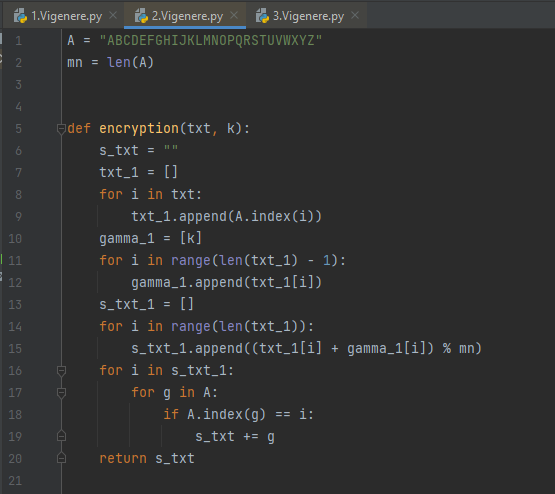
 
Рассмотрим этот рисунок поподробнее:

"A" – все символы английского алфавита по порядку

"mn" – мощность алфавита

На 5 строке кода функция "encryption" принимает на вход сообщение и
ключ, а возвращает шифртекст.

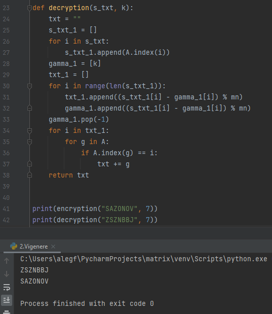 
 
Рассмотрим рисунок выше поподробнее:

На 23 строке кода функция "decryption" принимает на вход шифртекст и
ключ, а возвращает полученное сообщение.

Функция "print" на 41 строке выводит результат шифрования для функции
"encryption" с заданными значениями.

Функция "print" на 42 строке выводит результат расшифрования для функции
"decryption" с заданными значениями.

Заметим, что результат работы программы совпал с "ручным" шифрованием,
выполненным раннее в пункте 3.2.

## 4.3 Программная реализация шифра Виженера с использованием самоключа Виженера по шифртексту

Программная реализация шифра Виженера с использованием самоключа Виженера по шифртексту представлена на рисунках ниже:

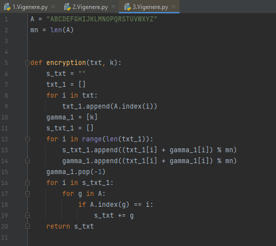 

Рассмотрим рисунок выше поподробнее:

"A" – все символы английского алфавита по порядку

"mn" – мощность алфавита

На 5 строке кода функция "encryption" принимает на вход сообщение и
ключ, а возвращает шифртекст.

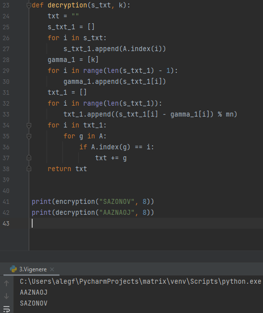 
 
Рассмотрим этот рисунок поподробнее:

На 23 строке кода функция "decryption" принимает на вход шифртекст и
ключ, а возвращает полученное сообщение.

Функция "print" на 41 строке выводит результат шифрования для функции
"encryption" с заданными значениями.

Функция "print" на 42 строке выводит результат расшифрования для функции
"decryption" с заданными значениями.

Заметим, что результат работы программы совпал с "ручным" шифрованием,
выполненным раннее в пункте 3.3.

# 5 Примеры криптоанализа

## 5.1 Метод криптоанализа для шифра Виженера с повторяющимся ключом

Рассмотрим один из методов криптоанализа для шифра Виженера с
повторяющимся ключом, который имеет уязвимость перед двухэтапным
статистическим криптоанализом (с помощью теста Касиски).

Пусть злоумышленнику известен следующий шифртекст:
"PSPOMEXPYXKSKKCCEPOEZCSJEXCVCLOGCCWYBCDYVNOSNVILYAYNEWCQMBIYXHKYVCZIMZPCYJBSJDOVCXXNBSDOWQSSLCHCMMBOXMCXSNCDYVCSKLVELQYYQIQSRMBHCBXMBEGCIRRIGBTPYJCCWGYRYVPCFIJWEISRELYQSRCCWLYAYNEWCQCKRQDLCKFGVMRIXMCTCKOYDPCKWRYRCPSPOMEXPYXKSKKCKQMXKRRIKYWRZSNEPYBJMBIGQRJKREEEEOWGXVSCWGKEPOILQPGCLEOVKKRQZELSWFPVCXGFKRBSXYVMYX"

Сначала вычислим длину ключа. Для этого воспользуемся специальной
программой, расположенной на специальном сайте и представленной на
рисунке ниже, которая находит повторения в шифртексте. \[1\]

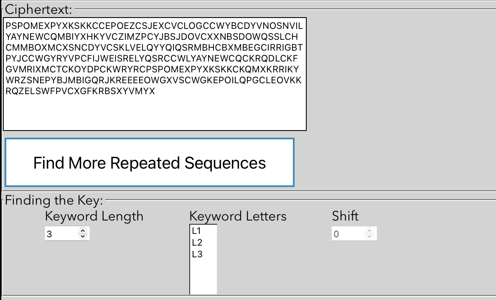

Результат выполнения данной программы представлен на рисунке:

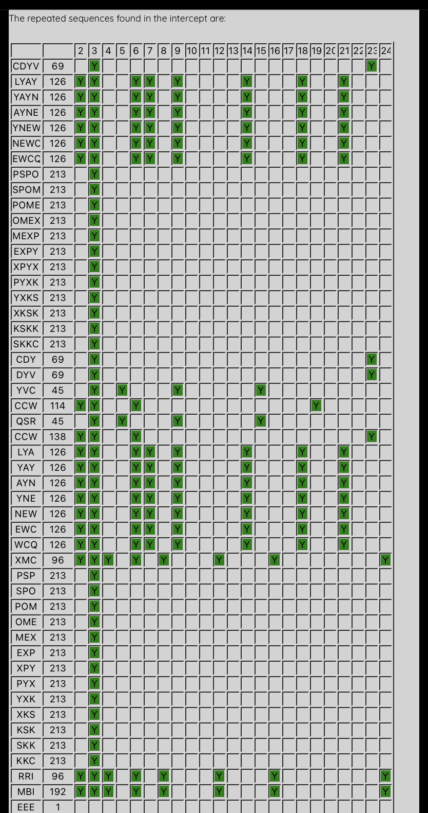

На этом рисунке самый левый столбик – это найденные повторения символов,
следующий столбик показывает расстояние между двумя этими повторениями,
верхняя строчка показывает вероятные ключи (делители расстояния между
повторениями). Из этого же рисунка можно сделать предположение, что
наиболее вероятная длина ключа равна 3.

Теперь воспользуемся программой для криптоанализа, представленную на
рисунке ниже и которая расположена на том же сайте \[1\], чтобы найти
наиболее вероятные символы для ключа:

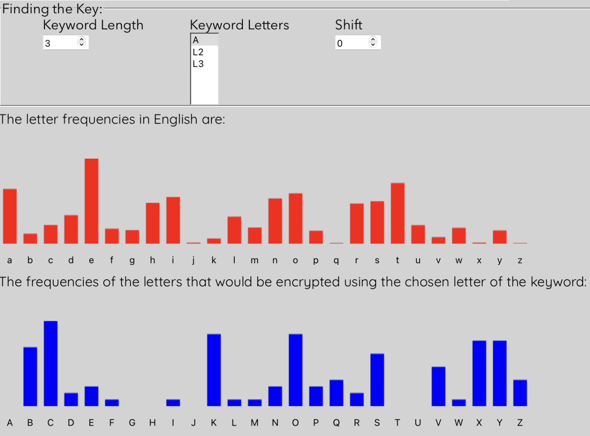

Красный график показывает частоту встречаемости символов английского
алфавита, а синий показывает частоту встречаемости каждого элемента
ключа из исходного шифртекста.

Теперь нужно сопоставить эти графики, чтобы получить первый элемент
ключа, что представлено на рисунке ниже:

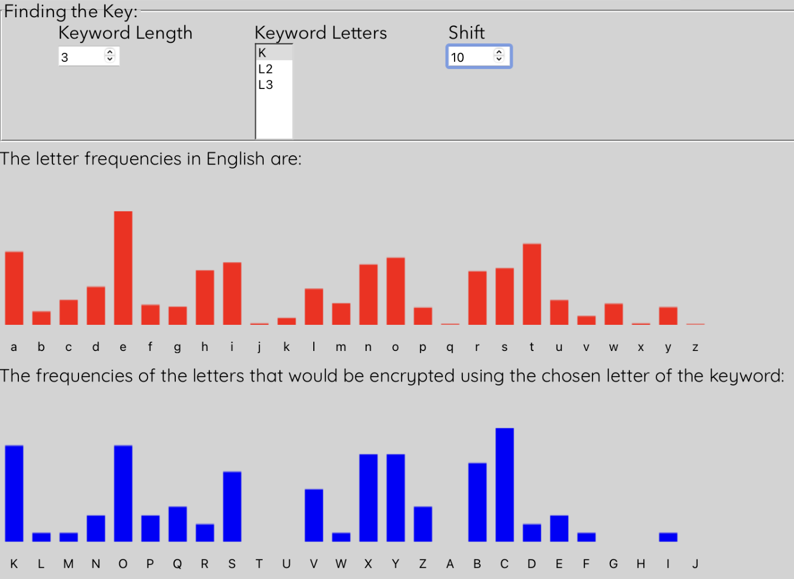

Видим, что наиболее вероятный исход такой, что первый элемент ключа –
"K".

Проводим те же действия с оставшимися двумя буквами элементами ключа,
что представлено на двух рисунках ниже:

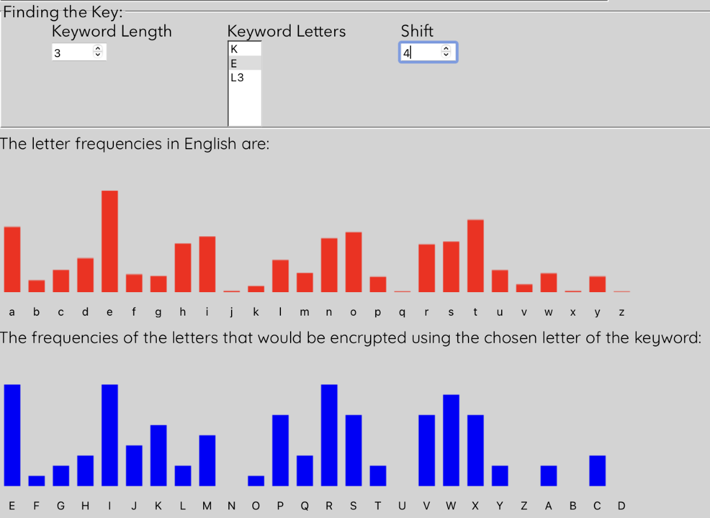 

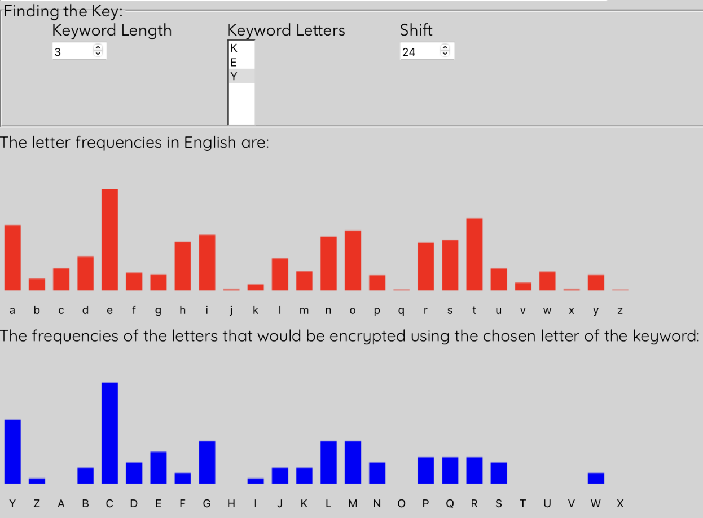 

В итоге получаем, что ключ равен "KEY". Теперь используем программу,
представленную на рисунке ниже, написанную раннее в пункте 4.1. Используя
исходный шифртекст и полученный ключ, заполняем нужными значениями
функцию "print" на строке 52:

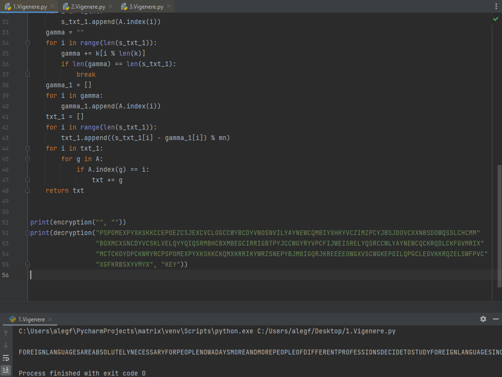 

В итоге получаем следующий читаемый текст, который означает, что все
описанные раннее предположения оказались верными:

FOREIGNLANGUAGESAREABSOLUTELYNECESSARYFORPEOPLENOWADAYSMOREANDMOREPEOPLEOFDIFFERENTPROFESSIONSDECIDETOSTUDYFOREIGNLANGUAGESINORDERTORAISETHEIRPROFESSIONALLEVELMAKINGBUSINESSNOWADAYSMEANSTHEABILITYTOSPEAKATLEASTONEFOREIGNLANGUAGEAMONGTHEMOSTPOPULARFOREIGNLANGUAGESINRUSSIAAREENGLISHGERMANSPANISHFRENCHANDITALIAN

Разделим полученный исходный текст для лучшей читаемости:

FOREIGN LANGUAGES ARE ABSOLUTELY NECESSARY FOR PEOPLE NOWADAYS MORE AND
MORE PEOPLE OF DIFFERENT PROFESSIONS DECIDE TO STUDY FOREIGN LANGUAGES
IN ORDER TO RAISE THEIR PROFESSIONAL LEVEL MAKING BUSINESS NOWADAYS
MEANS THE ABILITY TO SPEAK AT LEAST ONE FOREIGN LANGUAGE AMONG THE MOST
POPULAR FOREIGN LANGUAGES IN RUSSIA ARE ENGLISH GERMAN SPANISH FRENCH
AND ITALIAN

В итоге злоумышленник получил полностью исходное сообщение.

## 5.2 Криптоанализ шифра Виженера, который использует самоключ по открытому тексту

 Рассмотрим криптоанализ шифра Виженера, который использует самоключ по открытому тексту.

Пусть злоумышленник знает следующий шифртекст:

\"AALVVMAZHRUOJYCQIHGKPGVGALAKFCOZDLVVWMWJHVVRZMXRMTXUGRRVPYNQYZKKXTTBWBPCNOFJTIHQWALVVERVWLXTETWAVGALWGINAWALIVFSNQITFVWLLAVGALQULOLNQWNHQURANQWTIOGIVGALRBFKAOPONSLNQVSNQGHWWVKLAVGALIESL\".

Чтобы найти открытый текст, нужно применить программу, представленную на
рисунке ниже:

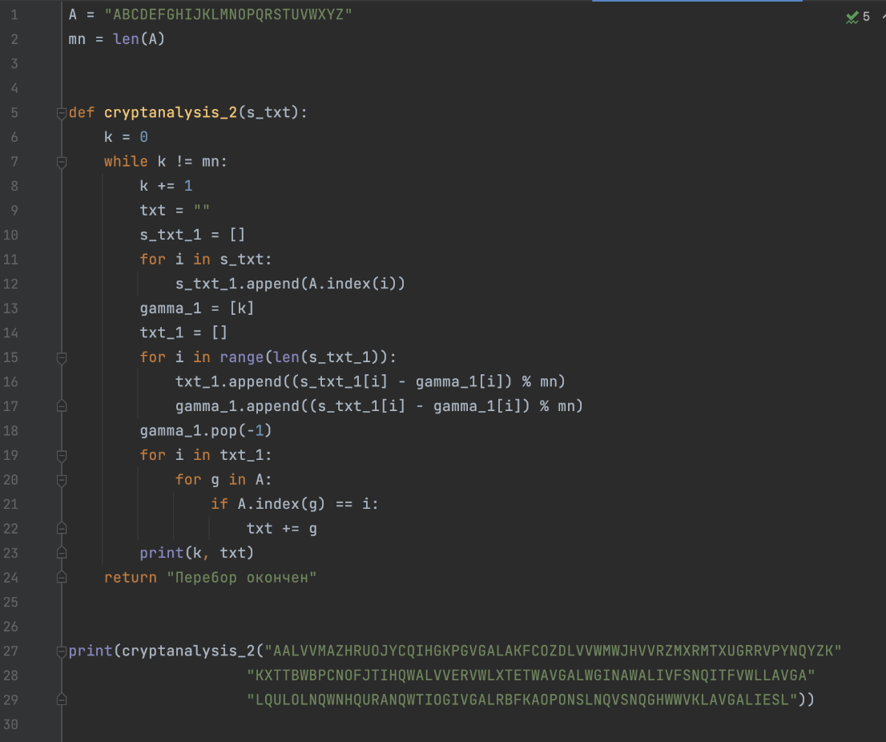  

Программа выполняет расшифрование шифртекста, перебрав все возможные
варианты ключа. Результат работы данной программы представлена на
рисунке ниже:

 

Теперь среди всех вариантов необходимо найти осмысленный, который
является исходным сообщением. Из рисунка выше можно заметить текст с
осмысленным смыслом, который получается при использовании ключа равного
7.

Значит открытый текст равен:

"THEREISHARDLYACOUNTRYINTHEWORLDWHERESUCHAVARIETYOFSCENERYANDVEGETATIONCANBEFOUNDTHEREARESTEPPESINTHESOUTHPLAINSANDFORESTSINTHEMIDLANDTUNDRAANDTAIGAINTHENORTHHIGHLANDSANDDESERTSINTHEEAST"

Теперь можно разделить сообщение для лучшей читаемости:

"THERE IS HARDLY A COUNTRY IN THE WORLD WHERE SUCH A VARIETY OF SCENERY
AND VEGETATION CAN BE FOUND THERE ARE STEPPES IN THE SOUTH PLAINS AND
FORESTS IN THE MIDLAND TUNDRA AND TAIGA IN THE NORTH HIGHLANDS AND
DESERTS IN THE EAST"

В итоге злоумышленник получил полностью исходное сообщение.

## 5.3 Криптоанализ шифра Виженера, который использует самоключ по шифртекст

 Рассмотрим, как сделать криптоанализ шифра Виженера, который использует самоключ по шифртекст.

Пусть злоумышленник знает следующий шифртекст:
"BIMDHHYCHVPGZXMQIWBTVCQEPHPCVCGKXDOWOVVILHLWOVZCWYYRZNASQIBFREYPHLCAPGOAARPHLNBORRIGGTWLCKFFYCUWDRFQIACQJUUHKRRJRKCQMZDGACCVDREWUMFJVRYGIPXPSAFKOFJWP".

Далее применим следующую программу, представленную на рисунке ниже,
которая делает расшифрование шифра Виженера, который использует самоключ
по шифртексту. Ключ берём равный случайному значению, например k = 0,
как представлено в этой программе:

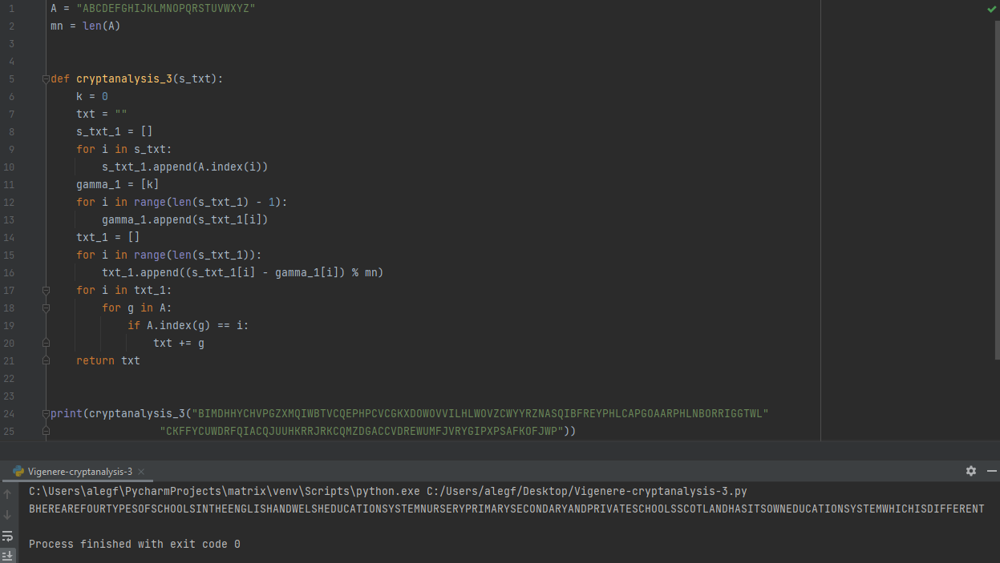 

В результате выполнения программы получаем следующий открытый текст:

"BHEREAREFOURTYPESOFSCHOOLSINTHEENGLISHANDWELSHEDUCATIONSYSTEMNURSERYPRIMARYSECONDARYANDPRIVATESCHOOLSSCOTLANDHASITSOWNEDUCATIONSYSTEMWHICHISDIFFERENT"

Подобрав первый символ и разделив полученный исходный текст для лучшей
читаемости, получаем:

"THERE ARE FOUR TYPES OF SCHOOLS IN THE ENGLISH AND WELSH EDUCATION
SYSTEM NURSERY PRIMARY SECONDARY AND PRIVATE SCHOOLS SCOTLAND HAS ITS
OWN EDUCATION SYSTEM WHICH IS DIFFERENT"

В итоге злоумышленник получил полностью исходное сообщение.

# 6 Выводы о проделанной работе

В процессе выполнения практической работы были рассмотрены шифры
гаммирования и их криптоанализ. Также был получен навык программной
реализации разных вариаций шифра Виженера с различными способами
выработки гаммы. Среди них: повторение короткого лозунга, самоключ
Виженера по открытому тексту и самоключ Виженера по шифртексту.

Одним из достоинств шифра Виженера можно выделить относительную простоту
в реализации и использовании, но при этом шифр остаётся достаточно
надежным.

# 7 Список использованных источников

1\. Kasiski Analysis: Breaking the Code. – URL: https://crypto.interactive-maths.com/kasiski-analysis-breaking-the-code.html (дата обращения 12.03.2023).

2\. Теория криптоанализа шифра Виженера. – URL: https://intuit.ru/studies/courses/13837/1234/lecture/31196?page=7(дата обращения 12.03.2023).
